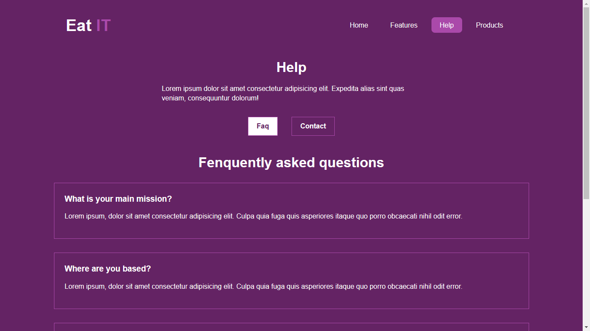

# React-router-dom 6.4+
- The latest version of React Router introduces powerful new patterns including data loading, mutations, and pending/skeleton UIs

---

### **Table of Contents :**
1. [Keywords](#Keywords)
1. [Installation](#Installation-process) 
1. [Using react-router-dom](#Implement-code-in-the-project)
1. [Fetching data](#Json-server)
1. [Final look](#A-final-look-at-the-project)
---


### **Keywords**
- createBrowserRouter
- createRoutesFromElements
- Route
- RouterProvider 
- Outlet
- Link, NavLink
- useLoaderData(), useParams()
- useRouteError(), useActionData()
- path, element, errorElement, loader
- form, redirect
---

## **Installation process**

1. Using npm
```bash
npm -i react-router-dom
```

2. Using yarn
```bash
yarn add react-router-dom
```

---

## **Implement code in the project**

1. Create a router variable with createBrowserRouter and add all the paths

```javascript
const router = createBrowserRouter(
  createRoutesFromElements(
    <Route path="/" element={<RootLayout />}>
      <Route index element={<Home />} />
      <Route path='features' element={<Features />} />
      <Route path='help' element={<HelpLayout />} >
        <Route path="faq" element={<Faq />} />
        <Route path="contact" element={<Contact />} />
      </Route>
      <Route path='products' element={<ProductsLayout />} errorElement={<ProductsError />}>
        <Route index element={<Products />} loader={productsLoader} />
        <Route path=":id" element={<SingleProduct />} loader={singleProductLoader} />
      </Route>
      <Route path="*" element={<NotFound />} />
    </Route>
  )
)
```
2. Connect router variable with RouterProvider using router attribute

```javascript
function App() {
  return (
    <div className="App">
      <RouterProvider router={router} />
    </div>
  );
}
``` 
---

## Json Server
1. Install Json server using npm:
```bash
npm install -g json-server
```
2. Create data folder and productsData.json file where we store products information

3. Start Json server:
```bash
json-server --watch data/productsData.json --port 7000
```


---
# A final look at the project





